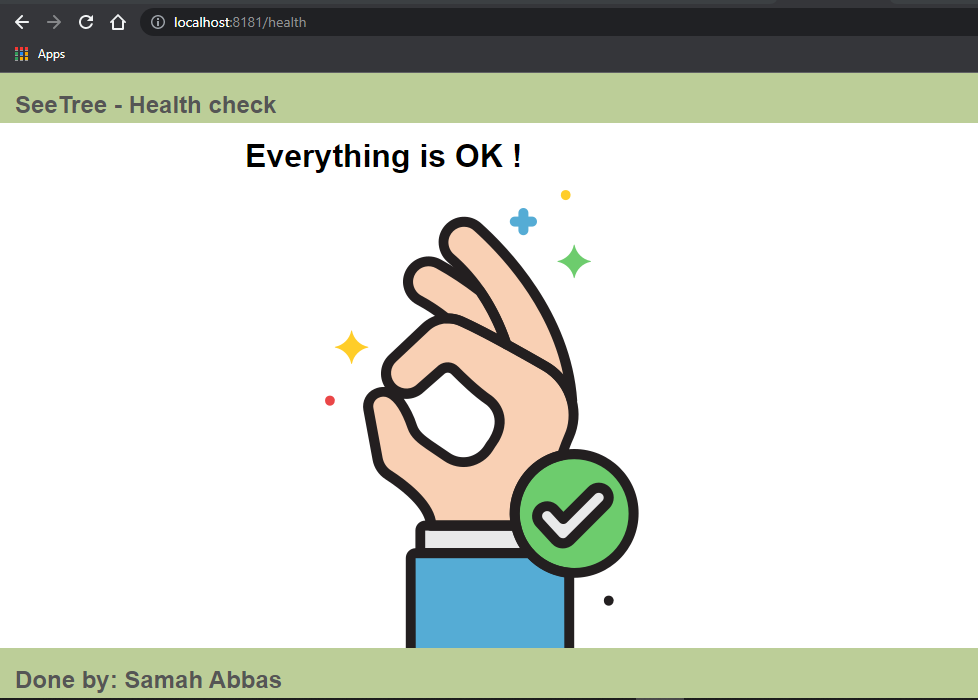

# SeeTree Task

### Requirements: 
Write a python web server using Flask framework:
The web server will support the following routes, both will support only GET requests :
- /health : will respond with “OK” to any request
- /stats/IMAGE_FILE_NAME/FUNC_NAME : will calculate FUNC_NAME on the pixels of given IMAGE_FILE_NAME and    return the result. 
    Supported FUNC_NAMES should be:
    - min
    - max
    - mean
    - median
    - pXXX where XXX is a percentile between 0...100. For example p10 is the  10th percentile of the image, p99 is the 99th percentile
______________________________________________
### Run the app  :
 In order to run the app:
 1. install pyhton3.10
 2. install the requiremnets (run ```pip install -r requirements.txt```)
 3. run the app
```
git clone https://github.com/samahAbbas11/SeeTree_Task.git
python ./img_Stats.py
```
______________________________________________
### Build & Run with docker-compose  :
By docker-compose we can run the dockerfile(app image) and Redis (for caching, further explanition below),in same service 
For the application: we expose the port 8181 in and out, and for Redis:we expose 6379.

```
docker-compose up -d --build
```

After runing the app ,you can then access the app HomePage here: http://localhost:8181 and what you'll see:


______________________________________________
## What you can do :

### You can request image & function directly by :

http://localhost:8181/stats/IMAGE_FILE_NAME/FUNC_NAME

- While IMAGE_FILE_NAME is one of these images :{IMG_1,IMG_2,IMG_3,IMG_4,IMG_5,IMG_6,IMG_7,IMG_8,IMG_9,IMG_10}
- and FUNC_NAME is one of these :{min, max, mean, median, pXXX (where XXX is a percentile between 0...100)}

### OR you can follow these steps :

- #### Visit Home page by  http://localhost:8181 and Click the "Open gallery" button:
     
     
- #### To choose an Image from the gallery click on it & you'll be moved to choose function page:
     
   
- #### click on the function you want :
     
     
- #### You'll see the result of the function and the image you chose :
     

______________________________________________
## Error Handling & Health Checks :

### In case of typing wrong function , image OR image doesn't exist in the bucket :

- Error Image:
    
    
         
- Error Function:
     
    

### Health-Check :

- By clicking "Health-Check" button in Home page:
    
    
    
- OR, Directly by accesing the url :  http://localhost:8181/health
    
    

______________________________________________
## Bonus :

### How can we make multiple identical requests (same image and same function) more efficient ?

In order to make the server more efficient , be faster and more consistent I impelemnted Caching with Redis and Flask.
So, the requests go through a cache toward the service hosting the resource. If any of the caches along the request path has a fresh copy of the requested representation, it uses that copy to satisfy the request. If none of the caches can satisfy the request, the request travels to the service.
- Redis , which stands for Remote Dictionary Server, is a fast, open source, in-memory, key-value data store.its to save the responses from the API, and then use those responses instead of making the requests to the server to fetch the data.
- Started the Redis instance with Docker
- Dockerize the app (by Dockerfile) and add Redis as a service .
- Then I will use docker-compose to run the containers of app image and Redis

    
    
### First request took 6.29 seconds :

,

### while the second same request took 897 ms :


    
  
